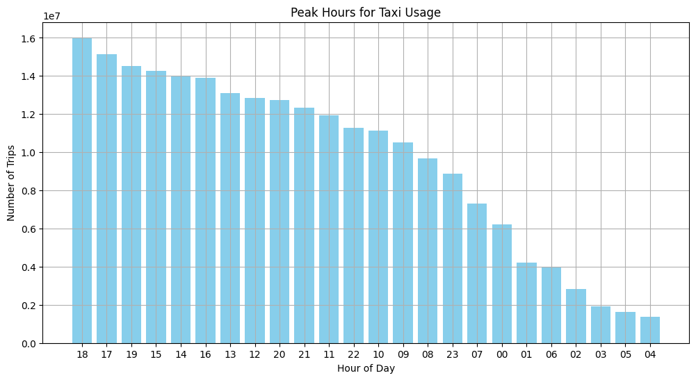
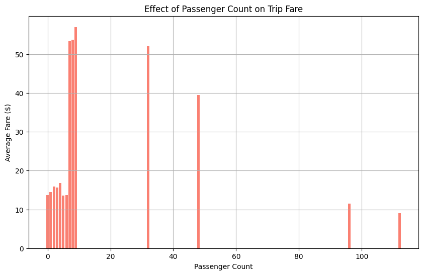
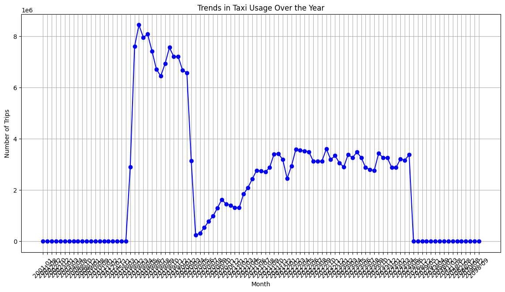

# New-York-Taxi-Data-Processing

## Project Overview

This project aims to design and implement a scalable data pipeline that extracts New York Taxi Trip data, processes it to derive analytical insights, and loads the processed data into a data warehouse for further analysis. The dataset includes fields such as pickup time, drop-off time, trip distances, fares, and passenger counts. The project is divided into several tasks including data extraction, data processing, data loading, and data analysis and reporting.

## Environment Setup

### Prerequisite

Steps to setup your local environment and execute the code.

1. Clone the repository
```sh
git clone https://github.com/sauravtanwar786/New-York-Taxi-Data-Processing.git
cd New-York-Taxi-Data-Processing
```

2. Make sure Python is installed. Install virtualenv if you don't have already virtualenv installed.
```sh
pip install virtualenv
virtualenv venv
source venv/bin/activate
```
3. Install the project dependencies
```sh
pip install -r requirements.txt
```

## Dataset link--
https://www.nyc.gov/site/tlc/about/tlc-trip-record-data.page

### Pipeline execution
1. Data extraction
```sh
 python data_extraction.py --start-year 2019 --end-year 2024 --start-month 01 --end-month 12

```

2. Data processing
```sh
python data_processing.py
```

3. Data Loading
```sh
python data_loading.py
```
4. Data analysis and reporting
```sh
python data_analysis_and_reporting.ipynb
```


## Data Extraction
The data extraction script automates the downloading of New York Taxi Trip data from the year 2019. The script handles network errors and retries the download if necessary.


## Data Processing
The data processing script cleans and transforms the data using Python and Pandas. It removes trips with missing or corrupt data, derives new columns such as trip duration and average speed, and aggregates data to calculate total trips and average fare per day.


## Data Loading
The data loading script loads the processed data into an SQLite database. It designs and implements a schema suitable for querying trip metrics and uses SQL to load data into the database efficiently.


## Data Analysis
To generate insights and reports from the database, run the following script:

Querying the Data--
### What are the peak hours for taxi usage?


To find peak hours, extract the hour from the tpep_pickup_datetime column and count the number of trips that occurred during each hour. The SQL query should:
```sql
SELECT strftime('%H', tpep_pickup_datetime) AS hour, COUNT(*) AS trip_count
FROM trips
GROUP BY hour
ORDER BY hour;
```
strftime('%H', tpep_pickup_datetime): Extracts the hour from the datetime.
COUNT(*): Counts the number of trips for each hour.
GROUP BY hour: Groups the results by the extracted hour.
ORDER BY hour: Orders the results by hour for sequential plotting


Visualization:
Bar Chart: Displays the number of trips for each hour, showing peak hours when usage is highest.

The output is a bar chart where:

X-axis: Represents the hours of the day (from 0 to 23).
Y-axis: Represents the number of trips.
Bars: Indicate the number of trips during each hour, helping identify peak hours.


### How does passenger count affect the trip fare?


To get the average fare for each passenger count. This is done by grouping the data by passenger_count and calculating the average fare_amount:
```sql
SELECT passenger_count, AVG(fare_amount) AS average_fare
FROM trips
GROUP BY passenger_count
ORDER BY passenger_count;
```

passenger_count: Number of passengers in the taxi.
AVG(fare_amount): Average fare amount for each passenger count.
GROUP BY passenger_count: Groups the results by passenger count.
ORDER BY passenger_count: Orders the results by passenger count for better readability.

Visualize the Data
Use Matplotlib to create a scatter plot or line plot to visualize the relationship between passenger count and average fare.
The output is a scatter plot or line plot where:

X-axis: Represents the number of passengers.
Y-axis: Represents the average fare amount.
Points/Line: Indicates how the average fare changes with the number of passengers.


### What are the trends in usage over the year?


```sql
SELECT strftime('%Y-%m', tpep_pickup_datetime) AS month, COUNT(*) AS trip_count
FROM trips
GROUP BY month
ORDER BY month;
```
strftime('%Y-%m', tpep_pickup_datetime) AS month: Extracts the year and month from the pickup datetime.
COUNT(*) AS trip_count: Counts the number of trips for each month.
GROUP BY month: Groups the results by month.
ORDER BY month: Orders the results by month for chronological accuracy.

Visualization:

Line/Bar Plot: Shows the number of trips per month.

The output is a line plot or bar plot where:

X-axis: Represents the months of the year.
Y-axis: Represents the number of trips.
Points/Bars: Show the monthly trip counts


